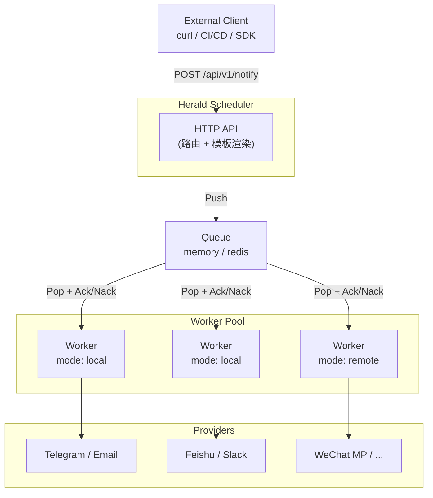

<div align="center">
  

  # Herald

  **Event-driven Delivery Infrastructure**

  [](https://go.dev/)
  [](https://github.com/cuihairu/herald/blob/main/LICENSE)
  [](https://codecov.io/gh/cuihairu/herald)
  [](./docs/architecture/coverage.md)
</div>

Herald 是一个事件驱动的通知投递基础设施。

## 两种使用形态

Herald 可以作为独立服务运行，也可以作为 Go 库嵌入你的进程，二者共享同一套核心管道（队列、路由、去重、模板、Provider）：

**CLI 网关** — 独立进程部署，REST API + Dashboard，适合作为组织级通知网关（见下方[快速开始](#快速开始)）：

```bash
curl -X POST http://localhost:8080/api/v1/notifications \
  -H "Content-Type: application/json" \
  -d '{"type": "deploy", "channels": ["feishu-ops"], "content": {"title": "v1.2.0 已发布"}}'
```

**Go 库** — 一个 `App` 完成入队与投递，零配置即可运行（内存队列 + 本地 worker 池），适合把通知能力直接嵌进自己的服务：

```go
import (
    "github.com/cuihairu/herald"
    "github.com/cuihairu/herald/core"
)

app, _ := herald.New(nil) // 默认：内存队列、后台投递池、去重
defer app.Close()

app.Dispatch(ctx, &core.Notification{
    Type:     "deploy",
    Channels: []string{"log"},
    Content:  &core.DirectContent{Title: "v1.2.0 已发布"},
})
```

完整导出面与嵌入指南见 [docs/library-usage.md](docs/library-usage.md)，可运行示例见 [examples/quickstart](examples/quickstart/main.go)。

## 特性

- **HTTP First** - curl 友好，REST API，无 SDK 依赖
- **Queue as Backbone** - Queue 是唯一的任务分发通道，支持 memory/redis
- **Unified Worker** - 统一 Worker 模型，local/remote 只区分部署方式
- **Rule Engine** - 表达式规则决定放行/抑制/改道，优先级 + 默认策略，shadow 模式先观察后生效，支持 for 持续判定、group_by 聚合、inhibit 抑制、silence 静默与 escalation 升级
- **Notification Groups** - 命名受众：任何渠道位可写 `group:<id>`，投递时展开成成员渠道（含收件人钉选），API 热更新花名册
- **Template System** - 与渠道无关的模板系统，一次定义多渠道复用
- **Multi-channel** - 统一接口对接 15+ 通知渠道
- **Dashboard** - Web 管理界面
- **Config First** - 通过配置文件加载 Provider、路由和模板

## 支持的 Provider

| Provider             | 类型     | 状态 |
| -------------------- | -------- | ---- |
| Log                  | Builtin  | ✅   |
| Telegram             | Builtin  | ✅   |
| Feishu               | Builtin  | ✅   |
| WeChat Work          | Builtin  | ✅   |
| Email (SMTP)         | Builtin  | ✅   |
| Generic Webhook      | Builtin  | ✅   |
| Discord              | Builtin  | ✅   |
| Slack                | Builtin  | ✅   |
| DingTalk             | Builtin  | ✅   |
| AliyunSMS            | Builtin  | ✅   |
| TencentSMS           | Builtin  | ✅   |
| NetEaseSMS           | Builtin  | ✅   |
| WeChat Push          | Builtin  | ✅   |
| WeChat Official (MP) | Builtin  | ✅   |

## 快速开始

### Docker 部署（推荐）

```bash
# 复制环境变量
cp .env.example .env

# 编辑 .env 文件
vim .env

# 启动服务
docker-compose up -d herald
```

### 本地运行

```bash
# 构建
make build

# 启动调度器
./bin/heraldd serve --config config.yaml

# 启动远程 Worker（分布式部署时）
./bin/heraldd worker --config worker.yaml

# 启动 Dashboard（另一个终端）
make dashboard-dev
```

### 访问 Dashboard

```
http://localhost:3000
```

登录后侧边栏可用的页面：仪表盘、Providers、通知规则、通知群组、Workers、日志、发送消息。其中「通知规则」与「通知群组」对应规则引擎与命名受众的完整 CRUD，也是配置路由与改道的主入口——Dashboard 保存规则时**同时编译表达式**，非法表达式当场被拒，不会等到派发时才发现。

## 使用

### 发送通知

```bash
curl -X POST http://localhost:8080/api/v1/notify \
  -H "Content-Type: application/json" \
  -d '{
    "title": "Node Offline",
    "body": "node-17 is offline",
    "level": "error",
    "channels": ["telegram", "email"]
  }'
```

### 使用模板发送

```bash
curl -X POST http://localhost:8080/api/v1/notify \
  -H "Content-Type: application/json" \
  -d '{
    "template": "server_alert",
    "params": {
      "Level": "CRITICAL",
      "Service": "order-service",
      "Server": "order-01",
      "Error": "CPU 使用率 95%"
    },
    "channels": ["email", "telegram"]
  }'
```

### 查看状态

```bash
curl http://localhost:8080/api/v1/status
```

### 查看 Providers

```bash
curl http://localhost:8080/api/v1/providers
```

## 架构



| 命令 | 模式 | 说明 |
|------|------|------|
| `heraldd serve` | 调度器 | API + Queue + local workers |
| `heraldd worker` | 远程 Worker | 从共享 Queue 消费，独立部署 |

### 部署模式

**单机**（memory 队列，所有 Worker 在同一进程内）：

```yaml
queue:
  type: memory
  workers: 0    # 自动：CPU核心数*2+1
```

**分布式**（redis 队列，调度器和 Worker 独立部署，需要 Redis 5.0+）：

```yaml
queue:
  type: redis
  workers: 4
  redis:
    addr: "localhost:6379"
    stream: "herald:tasks"
    group: "herald-workers"
```

## 配置

详见 [配置文档](./docs/guide/configuration.md)。

```yaml
server:
  addr: ":8080"
  timeout: 30s

providers:
  telegram:
    type: telegram
    enabled: true
    config:
      token: "${TELEGRAM_BOT_TOKEN}"
      chat_id: "${TELEGRAM_CHAT_ID}"

queue:
  type: memory
  workers: 0

routes:
  error: [telegram, email]

# 规则引擎（可选）：按表达式决定 放行/抑制/改道，未命中回落静态路由
# rules:
#   - id: prod-payment-failure
#     priority: 100
#     match: 'params.fail_rate > 0.05 && env == "prod"'
#     mode: active                # shadow 先观察，active 生效
#     route:
#       - channels: [feishu-oncall]
# rules_default_policy: allow     # 无 active 规则命中时：allow 保留静态路由，deny 扣下

# 通知群组（可选）：命名受众，任何渠道位都可写 "group:<id>"
# groups:
#   - id: ops-oncall
#     members:
#       - channel: feishu
#         recipients: ["@zhang"]
#       - channel: sms-duty
```

## 文档

完整文档请访问 [docs/](./docs/)

- [配置指南](./docs/guide/configuration.md)（规则引擎、通知群组、队列、Provider 全量配置项）
- [规则引擎决策层设计](./docs/design-rule-engine.md) · [通知群组设计](./docs/design-notification-groups.md)

## 开发

```bash
# 安装依赖
go mod download

# 运行测试
make test

# 构建
make build

# 运行文档服务
make docs-dev

# 运行 Dashboard
make dashboard-dev
```

## 许可证

[Apache License 2.0](./LICENSE)
