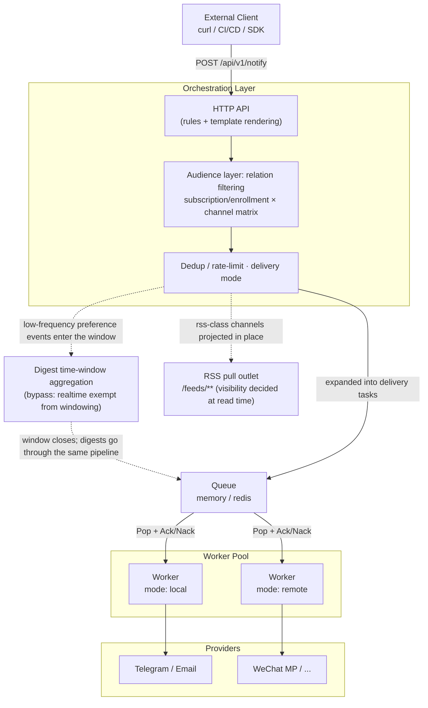

[English](README.md) | [中文](README.zh.md)

<div align="center">
  

  # Herald

  **Lightweight Notification Orchestration & Delivery Infrastructure**

  [](https://go.dev/)
  [](https://github.com/cuihairu/herald/blob/main/LICENSE)
  [](https://codecov.io/gh/cuihairu/herald)
  [](./docs/architecture/coverage.md)
</div>

Herald is a lightweight notification orchestration and delivery infrastructure. The business side only describes what happened and what to notify; who receives it, when, through which channel, at what intensity, whether it is aggregated, filtered, or escalated — Herald orchestrates all of that and is the single place where it is decided. Recipients stay in control: who receives which category on which channel, and at what frequency, is determined by the audience's own subscription relations and preferences, not hard-coded by the caller.

## Two Usage Modes

Herald runs as a standalone service or embeds into your process as a Go library. Both share the same core pipeline (queue, routing, dedup, templates, providers):

**CLI Gateway** — deployed as a standalone process with a REST API and Dashboard, suitable as an organization-wide notification gateway (see [Quick Start](#quick-start) below):

```bash
curl -X POST http://localhost:8080/api/v1/notify \
  -H "Content-Type: application/json" \
  -d '{"type": "deploy", "channels": ["feishu-ops"], "title": "v1.2.0 released"}'
```

**Go Library** — a single `App` handles enqueueing and delivery and runs with zero configuration (in-memory queue + local worker pool), suitable for embedding notification capability directly into your own service:

```go
import (
    "github.com/cuihairu/herald"
    "github.com/cuihairu/herald/core"
)

app, _ := herald.New(nil) // defaults: in-memory queue, background delivery pool, dedup
defer app.Close()

app.Dispatch(ctx, &core.Notification{
    Type:     "deploy",
    Channels: []string{"log"},
    Content:  &core.DirectContent{Title: "v1.2.0 released"},
})
```

The full exported surface and embedding guide are in [docs/library-usage.md](docs/library-usage.md); a runnable example lives at [examples/quickstart](examples/quickstart/main.go).

## Features

- **Unified subscription & delivery hub** - the audience is the only cross-system identity (applications hold only `user:<id>`/`group:<id>` and never touch channel credentials); two relation types — subscription and enrollment — carry the unsubscribe right and the must-deliver floor; unsubscribing stops all delivery
- **Contact-surface binding** - audiences bind reachable channels at runtime (TG chat, email, WeChat MP, RSS token); one-time deep-link tokens handle rebinding; an invalidated surface stops receiving
- **Preference center** - category × channel × frequency triples (realtime / daily / weekly / none) on top of a per-category default policy table; marketing defaults to weekly digest; alerts can be lowered in frequency but never silenced
- **Relation filtering** - a channel × relation matrix (subscriptions all-open, must-deliver rejects pull-style channels, marketing restricted to email/in-app) plus a four-step intersection recheck before sending; an empty intersection means no delivery, with the reason written to the audit trail
- **Delivery orchestration** - an expression rule engine (shadow mode observes before enforcing; for / group_by / inhibit / silence / escalation), Digest time-window aggregation (daily and weekly digests, realtime exemption, optional redis lease for leader election), content folding and dedup, request idempotency
- **RSS pull channel** - a public feed per category plus a private token-bearing feed per audience (`/feeds/**`); delivery records are projected in place as pull entries, visibility is decided at read time, and unsubscribing hides the entries from the next fetch. Herald does not push here, so this channel is spam-free by construction
- **Delivery audit** - a change trail for relations and contact surfaces, dedup folding details (why a given message was not delivered), and relation-type and entry-source snapshots in tasks and logs
- **HTTP First** - curl-friendly REST API, no SDK required
- **Queue as Backbone** - the queue is the only task dispatch channel; memory and redis backends are supported
- **Unified Worker** - one worker model; local and remote differ only in how they are deployed
- **Template System** - channel-agnostic templates, defined once and reused across channels
- **Multi-channel** - one unified interface for 18 built-in channels
- **Dashboard** - web management UI
- **Config First** - providers, routes, and templates load from the configuration file

## Supported Providers

| Provider             | Type     | Status |
| -------------------- | -------- | ------ |
| Log                  | Builtin  | ✅   |
| Telegram             | Builtin  | ✅   |
| Feishu               | Builtin  | ✅   |
| WeChat Work          | Builtin  | ✅   |
| Email (SMTP)         | Builtin  | ✅   |
| Generic Webhook      | Builtin  | ✅   |
| Discord              | Builtin  | ✅   |
| Slack                | Builtin  | ✅   |
| DingTalk             | Builtin  | ✅   |
| AliyunSMS            | Builtin  | ✅   |
| TencentSMS           | Builtin  | ✅   |
| NetEaseSMS           | Builtin  | ✅   |
| FCM                  | Builtin  | ✅   |
| Apple Push (APNs)    | Builtin  | ✅   |
| JPush                | Builtin  | ✅   |
| Getui                | Builtin  | ✅   |
| WeChat Push          | Builtin  | ✅   |
| WeChat Official (MP) | Builtin  | ✅   |
| Worker (remote)      | Builtin  | ✅   |

The `worker` type is the local placeholder for a remote worker node: its local
`Deliver` is a no-op and the scheduler routes the task to the node named by
`target` (see [Provider reference](./docs/providers/overview.md)).

## Quick Start

### Docker Deployment (Recommended)

```bash
# Copy the environment file
cp .env.example .env

# Edit .env
vim .env

# Start the service
docker-compose up -d herald
```

### Run Locally

```bash
# Build
make build

# Start the scheduler
./bin/heraldd serve --config config.yaml

# Start a remote worker (for distributed deployments)
./bin/heraldd worker --config worker.yaml

# Start the Dashboard (in another terminal)
make dashboard-dev
```

### Open the Dashboard

```
http://localhost:3000
```

After signing in, the sidebar exposes these pages: Dashboard, Providers, notification rules, notification groups, on-call rosters, the incident ledger, Workers, logs, and send message. Notification rules and notification groups back the full CRUD for the rule engine and named audiences, and they are the main entry point for configuring routes and rerouting. The Dashboard **compiles the expression on save** — an invalid expression is rejected on the spot instead of surfacing at dispatch time.

## Usage

### Send a Notification

```bash
curl -X POST http://localhost:8080/api/v1/notify \
  -H "Content-Type: application/json" \
  -d '{
    "title": "Node Offline",
    "body": "node-17 is offline",
    "level": "error",
    "channels": ["telegram", "email"]
  }'
```

### Send with a Template

```bash
curl -X POST http://localhost:8080/api/v1/notify \
  -H "Content-Type: application/json" \
  -d '{
    "template": "server_alert",
    "params": {
      "Level": "CRITICAL",
      "Service": "order-service",
      "Server": "order-01",
      "Error": "CPU usage 95%"
    },
    "channels": ["email", "telegram"]
  }'
```

### Check Status

```bash
curl http://localhost:8080/api/v1/status
```

### Check Providers

```bash
curl http://localhost:8080/api/v1/providers
```

## Architecture


```mermaid
graph TB
    Client["External Client<br/>curl / CI/CD / SDK"]

    subgraph Orchestration["Orchestration Layer"]
        API["HTTP API<br/>(rules + template rendering)"]
        Filter["Audience layer: relation filtering<br/>subscription/enrollment × channel matrix"]
        Fold["Dedup / rate-limit · delivery mode"]
    end

    Digest["Digest time-window aggregation<br/>(bypass: realtime exempt from windowing)"]
    RSS["RSS pull outlet<br/>/feeds/** (visibility decided at read time)"]

    Queue["Queue<br/>memory / redis"]

    subgraph Workers["Worker Pool"]
        W1["Worker<br/>mode: local"]
        W3["Worker<br/>mode: remote"]
    end

    subgraph Providers
        P1["Telegram / Email"]
        P3["WeChat MP / ..."]
    end

    Client -->|POST /api/v1/notify| API
    API --> Filter
    Filter --> Fold
    Fold -.->|"low-frequency preference events enter the window"| Digest
    Digest -.->|"window closes; digests go through the same pipeline"| Queue
    Fold -.->|"rss-class channels projected in place"| RSS
    Fold -->|"expanded into delivery tasks"| Queue
    Queue -->|Pop + Ack/Nack| W1
    Queue -->|Pop + Ack/Nack| W3
    W1 --> P1
    W3 --> P3
```

When the relation-filter intersection is empty, nothing is delivered and the reason is written to the delivery audit. The commands and deployment modes are unchanged:

| Command | Mode | Description |
|---------|------|-------------|
| `heraldd serve` | Scheduler | API + Queue + local workers |
| `heraldd worker` | Remote worker | Consumes from the shared queue, deployed independently |

### Deployment Modes

**Single node** (memory queue, all workers in the same process):

```yaml
queue:
  type: memory
  workers: 0    # automatic: CPU cores * 2 + 1
```

**Distributed** (redis queue, scheduler and workers deployed separately; requires Redis 6.2+):

```yaml
queue:
  type: redis
  workers: 4
  redis:
    addr: "localhost:6379"
    stream: "herald:tasks"
    group: "herald-workers"
```

## Configuration

See the [configuration guide](./docs/guide/configuration.md) for details.

```yaml
server:
  addr: ":8080"
  timeout: 30s

providers:
  telegram:
    type: telegram
    enabled: true
    config:
      token: "$TELEGRAM_BOT_TOKEN"     # env vars only support the $VAR form (${VAR} is not expanded)
      chat_id: "$TELEGRAM_CHAT_ID"

queue:
  type: memory
  workers: 0

routes:
  error: [telegram, email]

# level_routes (optional): level-based fallback when type routing misses
# level_routes:
#   warning: [email]

# channels block (optional): name a bundle of channels; writing the block name
# in the channels/channel field expands it into its member providers
# channels:
#   ci:
#     providers: [telegram, email]

# Rule engine (optional): allow / suppress / reroute by expression; on a miss,
# fall back to static routes
# rules:
#   - id: prod-payment-failure
#     priority: 100
#     match: 'params.fail_rate > 0.05 && env == "prod"'
#     mode: active                # shadow observes first, active enforces
#     route:
#       - channels: [feishu-oncall]
# rules_default_policy: allow     # when no active rule matches: allow keeps static routes, deny holds the message

# Notification groups (optional): named audiences; any channel slot accepts "group:<id>"
# groups:
#   - id: ops-oncall
#     members:
#       - channel: feishu
#         recipients: ["@zhang"]
#       - channel: sms-duty

# Digest time-window aggregation (optional): low-frequency preference events are
# collected per audience × category into daily/weekly digests
# digest:
#   enabled: true
#   daily: "09:00"                 # daily flip time (default 09:00)
#   weekly: "Mon 09:00"            # weekly flip time (default Mon 09:00)
#   location: Asia/Shanghai        # time zone for flip times (default Asia/Shanghai)
#   redis_addr: "localhost:6379"   # optional: multi-instance lease-based leader election;
#                                  # without it a single-process timer runs directly

# RSS pull channel (optional): public feed /feeds/<category>.xml + private feed /feeds/private/<token>.xml
# feeds:
#   enabled: true
#   title: "Herald notifications"  # RSS channel title (default "Herald notifications")
#   link: "https://herald.example" # feed home page link
#   description: "notification feed" # feed description
#   max_items: 500                 # per-category entry retention cap (default 500)
```

## Documentation

Full documentation is at [docs/](./docs/)

- [Integration guide](./docs/guide/integration.md) (external projects: from service address to first alert, app namespace, signed callbacks — self-serve, no questions needed)
- [Events and alert model](./docs/guide/events.md) (level vocabularies, dedup and idempotency, at-least-once delivery guarantees)
- [App integration API](./docs/api/apps.md) (per-endpoint reference for the `/apps/{app}/**` namespace) · [OpenAPI spec](./docs/api/openapi.yaml) (SDK code generation)
- [Configuration guide](./docs/guide/configuration.md) (rule engine, notification groups, audiences and contact surfaces, Digest, queues, and the full provider configuration reference)
- [Provider docs](./docs/providers/overview.md) (one page per channel: Telegram / Feishu / WeChat Work / DingTalk / Slack / Discord / WeChat Push / WeChat Official / Aliyun SMS / Tencent SMS / NetEase SMS / Email / FCM / APNs / JPush / Getui / Webhook / Log, plus the [SMS comparison](./docs/providers/sms.md))
- [Audience domain model (overview)](./docs/design-audience-model.md) · [Audience subscription & delivery hub (detailed design)](./docs/design-audience-relations.md) · [Concept boundaries and layered audit](./docs/design-audience-boundaries.md)
- [Rule engine decision-layer design](./docs/design-rule-engine.md) · [Notification groups design](./docs/design-notification-groups.md)

## Development

```bash
# Install dependencies
go mod download

# Run tests
make test

# Build
make build

# Run the docs site
make docs-dev

# Run the Dashboard
make dashboard-dev
```

## Foundation

Herald is built on open-source components; the core external dependencies are listed in [go.mod](./go.mod):

- [gorilla/websocket](https://github.com/gorilla/websocket) - WebSocket transport for remote workers
- [redis/go-redis](https://github.com/redis/go-redis) - Redis Stream client for the distributed queue
- [expr-lang/expr](https://github.com/expr-lang/expr) - expression evaluation for the rule engine
- [gopkg.in/yaml.v3](https://gopkg.in/yaml.v3) - configuration file parsing
- The Dashboard is built on React + Ant Design (bundled with Vite); the docs site is based on VitePress

The routing, rule engine, queue abstraction, templates, and the business code of the 18 channel providers are implemented in this repository.

## License

[Apache License 2.0](./LICENSE)
