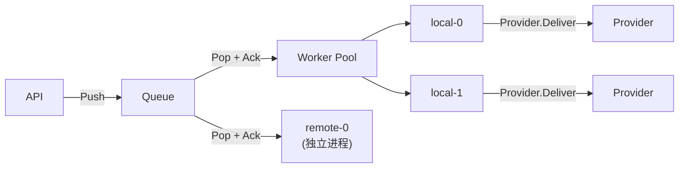
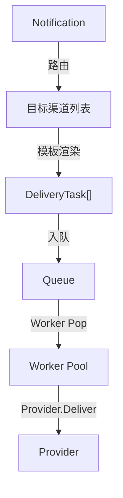

# 核心设计

## 系统定位

Herald 是：
- **事件驱动的投递基础设施**
- **统一 Worker 模型**
- **Queue 为骨干的任务分发平台**

Herald 不是：
- Plugin 系统
- 简单的 Webhook 聚合工具
- 消息推送 SDK

## 核心概念

### Worker 统一模型

所有 Worker 都是同一种东西，只通过 `mode` 区分部署方式：

- **local**：进程内 goroutine，直接调用内置 Provider
- **remote**：独立进程（`heraldd worker`），从共享 Queue 消费任务

**"谁来做" 是部署问题，"怎么做" 是 Provider 问题。** Queue 是唯一的任务分发通道。

### Queue as Backbone

Queue 提供可靠消费语义（Ack/Nack），支持背压、持久化（Redis 模式）。

### Provider vs Worker

| 概念 | 职责 | 关注点 |
|------|------|--------|
| Provider | 实现 Deliver 逻辑 | 怎么发 |
| Worker | 从 Queue 消费任务 | 谁来做 |

### Queue 实现

| 实现 | 适用场景 | Remote Worker |
|------|---------|---------------|
| `memory` | 单机，开发 | 不支持 |
| `redis` | 分布式，生产 | 支持 |

切换实现只需改配置，代码零改动。

### WebSocket 管理通道

WebSocket 不用于任务分发，仅作为远程 Worker 的管理通道：

- 注册（上报 ID、能力）
- 心跳（保活，超时自动注销）
- 状态上报（session 过期、需要扫码等）

## Delivery 抽象

### Notification → DeliveryTask

### Payload 类型

| PayloadKind | 说明 | 适用 Provider |
|-------------|------|--------------|
| `content` | 渲染后的内容 | Telegram、Email、Feishu 等 |
| `provider_template` | 服务商模板 | 阿里云 SMS、腾讯云 SMS |
| `raw` | 原始透传 | Worker Provider |

## 设计原则

### 1. HTTP First

主要接口是 HTTP REST API。

### 2. Queue First

Queue 是唯一的任务分发通道，不存在第二条路径。

### 3. Template First

模板定义与渠道无关，一次定义，多渠道复用。

### 4. Deploy Flexible

- 单机：`memory` 队列 + local workers
- 分布式：`redis` 队列 + local workers + remote workers
- 配置切换，代码不变
