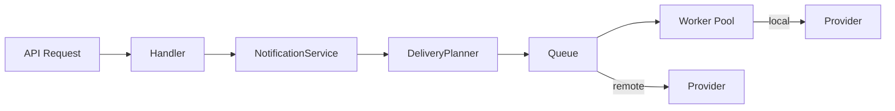

# 目录结构

## 项目结构

```
herald/
├── herald.go                 # 库形态入口（herald.New Facade）
├── cmd/
│   └── heraldd/              # 统一入口（serve / worker 子命令）
│
├── config/                   # 配置管理（Load/Default）
│   └── config.go
│
├── core/                     # 核心模块
│   ├── types.go              # 核心类型（Notification, DeliveryTask, Queue）
│   ├── provider.go           # Provider/CapableProvider 接口 + Capability
│   ├── worker/               # 统一 Worker 架构
│   │   ├── pool.go           # Worker Pool（管理 local worker goroutine）
│   │   └── registry.go       # Worker 注册表（local + remote）
│   ├── dispatch/             # 调度器（Worker Pool 的薄封装）
│   │   └── dispatcher.go
│   ├── queue/                # 任务队列
│   │   ├── queue.go          # Queue 接口
│   │   ├── memory.go         # 内存队列实现
│   │   ├── redis.go          # Redis Stream 实现
│   │   └── factory.go        # 队列工厂
│   ├── route/                # 路由引擎（routes + level_routes）
│   ├── retry/                # 重试机制
│   ├── errclass/             # Provider 错误六类分类
│   ├── dedup/                # 去重机制
│   ├── limiter/              # 限流机制
│   ├── runtime/              # Runtime 管理（Provider 注册 + 投递 + 重试）
│   │   └── manager.go
│   ├── service/              # 服务层
│   │   ├── notification.go   # NotificationService 编排层
│   │   └── planner.go        # DeliveryPlanner（payload/格式选择）
│   ├── template/             # 模板系统
│   ├── audience/             # 受众与收件人（audiences/recipients 表）
│   ├── groups/               # 通知群组（group: 展开）
│   ├── roster/               # 值班花名册
│   ├── rules/                # 规则引擎（silence/inhibit/for/改道）
│   ├── ack/                  # 告警确认
│   ├── escalation/           # 升级策略
│   ├── incident/             # 事件（ack 聚合、状态派生）
│   ├── auth/                 # 认证（login/refresh/me）
│   ├── jwt/                  # JWT 签发校验
│   ├── user/                 # 用户模型
│   ├── logstore/             # 投递日志存储
│   ├── httpclient/           # 统一 HTTP 客户端
│   ├── websocket/            # WebSocket（远程 Worker 管理通道）
│   │   ├── server.go         # WebSocket 服务器
│   │   └── hub.go            # Worker 注册/心跳管理
│   └── ...
│
├── api/                      # HTTP API
│   ├── handler.go            # 请求处理器 + 通用响应
│   ├── handler_*.go          # 各资源处理器（notify/alerts/incidents/... 共 15 个）
│   ├── idempotency.go        # 幂等键存储
│   └── server.go             # HTTP 服务器 + 路由注册
│
├── protocol/                 # 内部协议定义
│   └── message.go            # WebSocket 消息类型
│
├── providers/                # Provider 实现
│   └── builtin/              # 内置 Provider（19 个 Factory）
│       ├── registry/         # Provider 注册
│       ├── log/              # 日志
│       ├── telegram/         # Telegram
│       ├── feishu/           # 飞书
│       ├── wecom/            # 企业微信
│       ├── dingtalk/         # 钉钉
│       ├── slack/            # Slack
│       ├── discord/          # Discord
│       ├── email/            # 邮件
│       ├── webhook/          # Webhook
│       ├── aliyunsms/        # 阿里云 SMS
│       ├── tencentsms/       # 腾讯云 SMS
│       ├── neteasesms/       # 网易云 SMS
│       ├── wechat/           # 微信（Server酱）
│       ├── wechatmp/         # 微信公众号
│       ├── fcm/              # FCM 推送
│       ├── apns/             # APNs 推送
│       ├── jpush/            # 极光推送
│       ├── getui/            # 个推
│       └── worker/           # Worker Provider（代理远程 Worker）
│
├── apps-sdk/                 # 集成方 SDK（app 命名空间接入）
│   └── go/                   # Go SDK
├── worker-sdk/               # Worker SDK
│   └── go/                   # Go SDK + example
│
├── internal/                 # 内部包
│   └── logger/               # 日志管理
│
├── examples/                 # 示例
│   └── quickstart/           # 快速开始示例（计入覆盖率门禁）
├── dashboard/                # 前端控制台（Vite + Vitest）
├── tools/                    # 覆盖率门禁脚本（covermerge/zero_check）
├── docs/                     # 文档
├── config.yaml               # 配置文件
├── Makefile                  # 构建脚本
└── README.md
```

## 数据流



## 配置示例

```yaml
# 调度器模式
queue:
  type: memory          # memory | redis
  workers: 0            # 0 = CPU*2+1

# 分布式模式
queue:
  type: redis
  workers: 4
  redis:
    addr: "localhost:6379"
    stream: "herald:tasks"
    group: "herald-workers"
```
