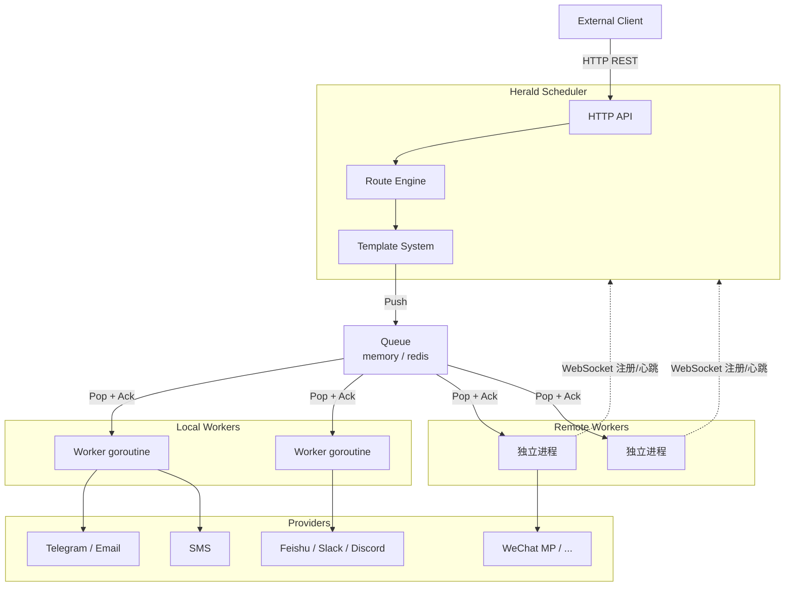

# 架构概述

## 项目定位

Herald 是一个：

> **事件驱动的通知投递基础设施**（Event-driven Delivery Infrastructure）

**核心流程：**

```
Event → Route → Render → Queue → Worker → Provider
```

## 核心设计思想

### 1. HTTP First

Herald 的主要用户接口是 **HTTP REST API**，而不是 SDK。

**原因：**

- curl 即可使用
- 自动化友好
- CI/CD 友好
- 多语言天然兼容
- 降低接入成本

### 2. Queue as Backbone

Queue 是唯一的任务分发通道。所有 Worker（无论 local 还是 remote）都从 Queue 消费任务。

```
API → Queue → Worker Pool
                  ├── local worker (goroutine) → builtin provider
                  └── remote worker (独立进程) → custom provider
```

### 3. Unified Worker Model

所有 Worker 是同一个概念，只通过 `mode` 区分部署方式：

| Worker 类型 | 部署 | 任务来源 |
|------------|------|---------|
| Local | 进程内 goroutine | Queue (memory/redis) |
| Remote | 独立进程 | Queue (redis) |

### 4. Event First

Herald 不只是"发送消息"，而是"处理事件"。

**示例事件：**

```json
{
  "type": "node.offline",
  "labels": {
    "region": "shanghai"
  }
}
```

## 总体架构



## 运行模式

```bash
# 单机模式（memory 队列 + local workers）
heraldd serve --config config.yaml

# 分布式：调度器
heraldd serve --config scheduler.yaml

# 分布式：远程 Worker
heraldd worker --config worker.yaml
```

## 最终定位

Herald：**Event-driven Delivery Infrastructure**

**核心价值：**

- 统一事件
- 统一队列
- 统一 Worker
- 统一投递
