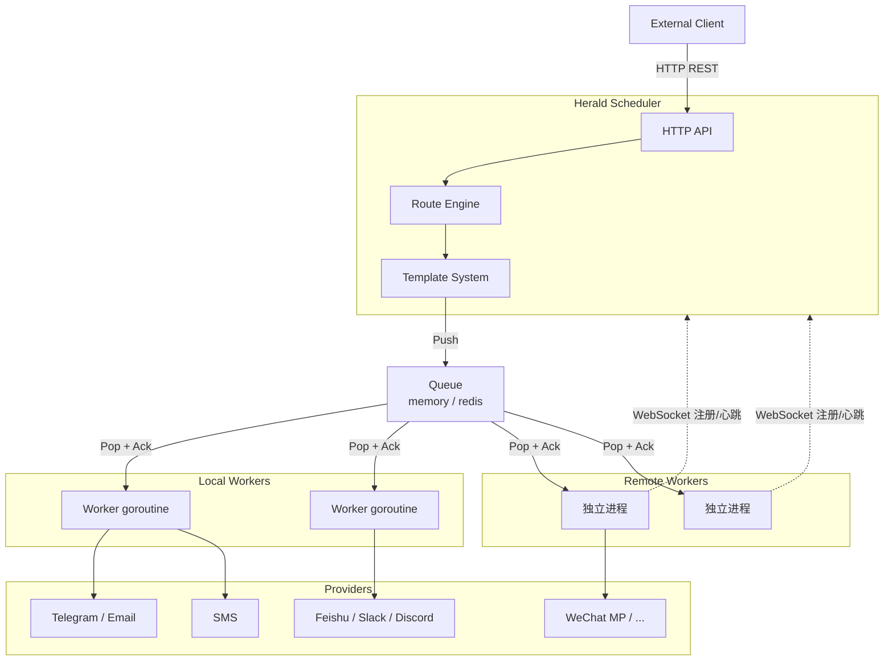

# 架构概述

## 项目定位

Herald 是一个：

> **轻量、Provider 无关的统一订阅与投递中枢**（Lightweight, Provider-agnostic Subscription & Delivery Hub）

为业务系统、运维、CI/CD、Agent 和自动化任务提供统一的通知路由、受众管理与多渠道可靠投递能力；被通知者做主——谁在什么渠道、以什么频率收到什么品类，由受众自己的关系决定。事件驱动（Event-driven Delivery Infrastructure）是其工作方式，Provider 无关是其边界承诺。

**核心流程：**

```
Event → Notification → Routing → Delivery Task → Queue → Worker → Provider
```

- **Notification** 描述「通知什么、面向谁、用什么模板」，不知道任何 Provider 细节；
- **Routing** 把 Notification 展开成若干 **Delivery Task**（受众解析 + 通道路由）；
- 每条 Delivery 独立状态、独立重试，与 Notification 的受理状态分离；
- 完整领域模型（术语契约、受众层扩展、落地状态）见 [受众领域模型总纲](/design-audience-model)。

## 领域模型与边界

Herald 的领域模型围绕一条通知在系统内的完整旅程展开：

```text
Audience（通知谁）── group:ops / user:alice
    ↓
Recipient（具体是谁）      Channel（哪类通知：ci / ops / security）
    ↓
Endpoint（什么地址）       Template（内容如何生成）
    ↓
Routing（展开成哪些投递）
    ↓
Delivery Task（一次具体渠道投递）→ Queue → Worker → Provider
```

模型必须守住以下边界，它们是本架构的核心：

```text
Notification ≠ Delivery Task      —— 一条通知可展开成多条投递，状态互不混淆
Audience     ≠ Channel            —— 「通知谁」与「哪类通知」是两个维度
Channel      ≠ Provider           —— 逻辑通道与投递实现解耦，通道可换渠道
Recipient    ≠ Endpoint           —— 一个人可拥有多个地址，地址可换渠道
Routing      ≠ Delivery           —— 展开决策与执行任务分离
Provider     ≠ Business Logic     —— Provider 只做请求构造/调用/错误转换
```

各边界的落地现状见 [受众领域模型总纲](/design-audience-model) §13；逐批执行记录与留批拍板见[现状审计](/design-audience-audit)（Phase 0-9 已全批落地）：Notification / Channel（routes 路由 + `channels` 独立配置块，显式 provider > channels 块 > routes 表）/ Delivery Task（显式状态机 queued/delivering/retrying/delivered/failed/dead + MaxAttempts/LastError + NextRetryAt）/ Queue / Worker / Provider、通知群组（`group:` 形态受众）、`user:` 级 Recipient 与多 Endpoint（配置化：`audiences` / `recipients` 配置块 + `user:` 引用展开）、Provider 错误六类分类（Temporary/Permanent/RateLimited/Authentication/InvalidRequest/Timeout，分类骑错误链、wire 文本不变）以及 notify API 的领域字段（`channel` / `audience` / `data` / `idempotency_key`，见 [REST API](/api/rest#notify-receivers)）。可重试失败的等待在队列侧：任务带 `next_retry_at` 重新入队（队列实现 `Scheduler` 能力时），worker 不睡退避。明确留批：Logs/Delivery 事件流分离，已在审计中记录留批理由。受众层的订阅侧扩展（关系/联系面/偏好/Digest/RSS/集成 API）按[关系详设](/design-audience-relations)分批推进。

## 核心设计思想

### 1. HTTP First

Herald 的主要用户接口是 **HTTP REST API**，而不是 SDK。curl 就能调，脚本、CI/CD 和任何语言都不用装依赖，接入成本压到一个 HTTP 请求。

### 2. Queue as Backbone

Queue 是唯一的任务分发通道。所有 Worker（无论 local 还是 remote）都从 Queue 消费任务。

```
API → Queue → Worker Pool
                  ├── local worker (goroutine) → builtin provider
                  └── remote worker (独立进程) → custom provider
```

### 3. Unified Worker Model

所有 Worker 是同一个概念，只通过 `mode` 区分部署方式：

| Worker 类型 | 部署 | 任务来源 |
|------------|------|---------|
| Local | 进程内 goroutine | Queue (memory/redis) |
| Remote | 独立进程 | Queue (redis) |

### 4. Event First

Herald 的核心职责是处理事件，发送消息只是事件处理链条的最后一环。

**示例事件：**

```json
{
  "type": "node.offline",
  "labels": {
    "region": "shanghai"
  }
}
```

## 总体架构


```mermaid
graph TB
    Client["External Client"]

    subgraph Scheduler["Herald Scheduler"]
        API["HTTP API"]
        Router["Route Engine"]
        Template["Template System"]
        API --> Router --> Template
    end

    Queue["Queue<br/>memory / redis"]

    subgraph LocalWorkers["Local Workers"]
        LW1["Worker goroutine"]
        LW2["Worker goroutine"]
    end

    subgraph RemoteWorkers["Remote Workers"]
        RW1["独立进程"]
        RW2["独立进程"]
    end

    subgraph Providers["Providers"]
        P1["Telegram / Email"]
        P2["Feishu / Slack / Discord"]
        P3["SMS"]
        P4["WeChat MP / ..."]
    end

    Client -->|HTTP REST| API
    Template -->|Push| Queue
    Queue -->|Pop + Ack| LW1
    Queue -->|Pop + Ack| LW2
    Queue -->|Pop + Ack| RW1
    Queue -->|Pop + Ack| RW2
    RW1 -.->|WebSocket 注册/心跳| Scheduler
    RW2 -.->|WebSocket 注册/心跳| Scheduler
    LW1 --> P1
    LW2 --> P2
    LW1 --> P3
    RW1 --> P4
```

## 运行模式

```bash
# 单机模式（memory 队列 + local workers）
heraldd serve --config config.yaml

# 分布式：调度器
heraldd serve --config scheduler.yaml

# 分布式：远程 Worker
heraldd worker --config worker.yaml
```

## 最终定位

**Lightweight, Provider-agnostic Subscription & Delivery Hub**。落到使用上：业务侧只描述「发生了什么、通知什么、通知谁」；受众/通道/规则的路由、队列与 Worker、投递的独立状态与独立重试，全部由 Herald 收口；投给谁、投到哪个渠道、以什么频率，由受众的关系与偏好做主。
