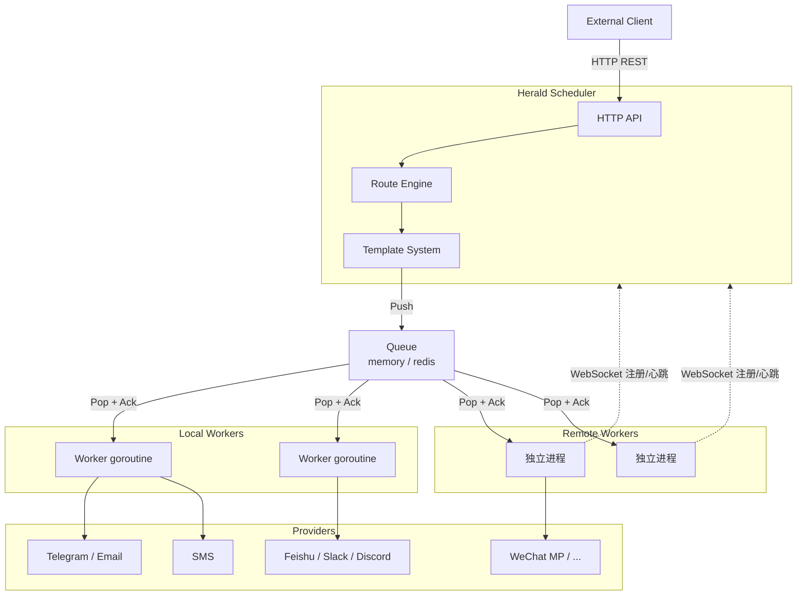

# 架构概述

## 项目定位

Herald 是一个：

> **轻量、Provider 无关的通知投递基础设施**（Lightweight, Provider-agnostic Notification Delivery Infrastructure）

为业务系统、运维、CI/CD、Agent 和自动化任务提供统一的通知路由、受众管理与多渠道可靠投递能力——事件驱动（Event-driven Delivery Infrastructure）是其工作方式，Provider 无关是其边界承诺。

**核心流程：**

```
Event → Notification → Routing → Delivery Task → Queue → Worker → Provider
```

- **Notification** 描述「通知什么、面向谁、用什么模板」，不知道任何 Provider 细节；
- **Routing** 把 Notification 展开成若干 **Delivery Task**（受众解析 + 通道路由）；
- 每条 Delivery 独立状态、独立重试，与 Notification 的受理状态分离；
- 完整领域模型与落地计划见 [Audience 领域模型](/design-audience-model)。

## 领域模型与边界

Herald 的领域模型围绕一条通知在系统内的完整旅程展开：

```text
Audience（通知谁）── group:ops / user:alice
    ↓
Recipient（具体是谁）      Channel（哪类通知：ci / ops / security）
    ↓
Endpoint（什么地址）       Template（内容如何生成）
    ↓
Routing（展开成哪些投递）
    ↓
Delivery Task（一次具体渠道投递）→ Queue → Worker → Provider
```

模型必须守住以下边界，它们是本架构的核心：

```text
Notification ≠ Delivery Task      —— 一条通知可展开成多条投递，状态互不混淆
Audience     ≠ Channel            —— 「通知谁」与「哪类通知」是两个维度
Channel      ≠ Provider           —— 逻辑通道与投递实现解耦，通道可换渠道
Recipient    ≠ Endpoint           —— 一个人可拥有多个地址，地址可换渠道
Routing      ≠ Delivery           —— 展开决策与执行任务分离
Provider     ≠ Business Logic     —— Provider 只做请求构造/调用/错误转换
```

各边界的落地现状与缺口拆解见 [Audience 领域模型](/design-audience-model)（执行中）：已实现 Notification / Channel（routes 路由）/ Delivery Task / Queue / Worker / Provider、通知群组（`group:` 形态受众）、`user:` 级 Recipient 与多 Endpoint（配置化 MVP：`audiences` / `recipients` 配置块 + `user:` 引用展开）、Delivery 显式状态机（queued/delivering/retrying/delivered/failed/dead，同步重试）以及 notify API 的领域字段（`channel` / `audience` / `data` / `idempotency_key`，见 [REST API](/api/rest#notify-receivers)）；Channel 独立配置块、错误分类接口与异步重新入队为后续规划项。

## 核心设计思想

### 1. HTTP First

Herald 的主要用户接口是 **HTTP REST API**，而不是 SDK。

**原因：**

- curl 即可使用
- 自动化友好
- CI/CD 友好
- 多语言天然兼容
- 降低接入成本

### 2. Queue as Backbone

Queue 是唯一的任务分发通道。所有 Worker（无论 local 还是 remote）都从 Queue 消费任务。

```
API → Queue → Worker Pool
                  ├── local worker (goroutine) → builtin provider
                  └── remote worker (独立进程) → custom provider
```

### 3. Unified Worker Model

所有 Worker 是同一个概念，只通过 `mode` 区分部署方式：

| Worker 类型 | 部署 | 任务来源 |
|------------|------|---------|
| Local | 进程内 goroutine | Queue (memory/redis) |
| Remote | 独立进程 | Queue (redis) |

### 4. Event First

Herald 不只是"发送消息"，而是"处理事件"。

**示例事件：**

```json
{
  "type": "node.offline",
  "labels": {
    "region": "shanghai"
  }
}
```

## 总体架构


```mermaid
graph TB
    Client["External Client"]

    subgraph Scheduler["Herald Scheduler"]
        API["HTTP API"]
        Router["Route Engine"]
        Template["Template System"]
        API --> Router --> Template
    end

    Queue["Queue<br/>memory / redis"]

    subgraph LocalWorkers["Local Workers"]
        LW1["Worker goroutine"]
        LW2["Worker goroutine"]
    end

    subgraph RemoteWorkers["Remote Workers"]
        RW1["独立进程"]
        RW2["独立进程"]
    end

    subgraph Providers["Providers"]
        P1["Telegram / Email"]
        P2["Feishu / Slack / Discord"]
        P3["SMS"]
        P4["WeChat MP / ..."]
    end

    Client -->|HTTP REST| API
    Template -->|Push| Queue
    Queue -->|Pop + Ack| LW1
    Queue -->|Pop + Ack| LW2
    Queue -->|Pop + Ack| RW1
    Queue -->|Pop + Ack| RW2
    RW1 -.->|WebSocket 注册/心跳| Scheduler
    RW2 -.->|WebSocket 注册/心跳| Scheduler
    LW1 --> P1
    LW2 --> P2
    LW1 --> P3
    RW1 --> P4
```

## 运行模式

```bash
# 单机模式（memory 队列 + local workers）
heraldd serve --config config.yaml

# 分布式：调度器
heraldd serve --config scheduler.yaml

# 分布式：远程 Worker
heraldd worker --config worker.yaml
```

## 最终定位

Herald：**Lightweight, Provider-agnostic Notification Delivery Infrastructure**

**核心价值：**

- 业务只描述「发生了什么、通知什么、通知谁」，不关心渠道细节
- 统一路由（受众 / 通道 / 规则）
- 统一队列与 Worker
- 统一投递生命周期（Delivery 独立状态、独立重试）
